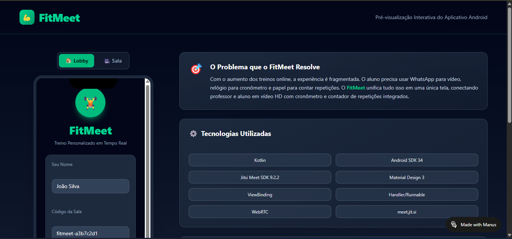

# 💪 FitMeet — Treino Personalizado em Tempo Real

<div align="center">
  
</div>

## 📝 Descrição do Projeto
O **FitMeet** é uma solução de videoconferência interativa projetada para otimizar a experiência de treinamentos remotos[cite: 2]. O foco do desenvolvimento foi mitigar a fragmentação do ecossistema de treino online, unificando camadas de comunicação e monitoramento em uma interface centralizada[cite: 2].

### 🎯 O Problema que o FitMeet Resolve
Atualmente, a experiência de treino à distância é fragmentada: o usuário depende de aplicações externas para vídeo, cronômetros independentes e registros manuais de performance[cite: 2]. O FitMeet consolida essas necessidades, integrando vídeo em alta definição com ferramentas de controle técnico em tempo real[cite: 2].

## 🚀 Tecnologias Utilizadas
A arquitetura da solução utiliza um stack focado em estabilidade e baixa latência[cite: 2]:

*   **Linguagem Principal:** Kotlin[cite: 2].
*   **Android SDK:** Nível 34[cite: 2].
*   **Comunicação de Vídeo:** Jitsi Meet SDK 9.2.2 (implementação WebRTC)[cite: 2].
*   **Interface (UI):** Material Design 3 e ViewBinding[cite: 2].
*   **Lógica de Sincronia:** Handler e Runnable para gerenciamento de threads do cronômetro[cite: 2].
*   **Infraestrutura de Sinalização:** meet.jit.si[cite: 2].

## 🏗️ Estrutura do Repositório
A organização segue os padrões de projetos mobile estruturados[cite: 1]:

```text
atividade-manus-ai-main/
├── app/               ← Módulos de código fonte e lógica de negócio[cite: 1]
├── preview/           ← Assets de visualização (preview.png.png)[cite: 1]
├── gradle/wrapper/    ← Gerenciamento de dependências e build[cite: 1]
├── build.gradle       ← Configurações globais de compilação[cite: 1]
└── qrcode_preview.png ← Recurso de acesso rápido ao aplicativo[cite: 1]
